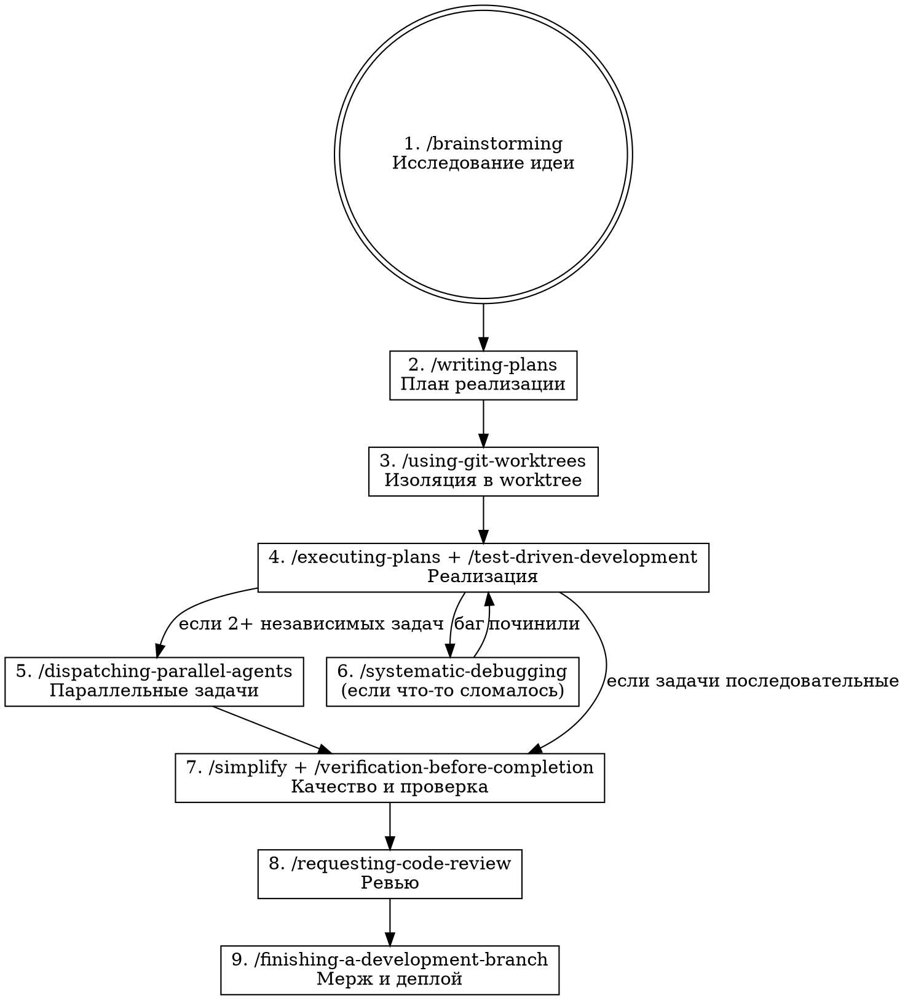

# Pipeline: от идеи до продакшена

Полный автоматический пайплайн из 9 этапов. Запускается одной командой `/pipeline`. Каждый этап вызывает соответствующий скилл и передаёт результат в следующий.

## Запуск

Пользователь пишет `/pipeline` и описывает идею. Дальше всё идёт автоматически.

## Этапы



## Протокол выполнения

### Этап 1 — Brainstorming
Вызови скилл `superpowers:brainstorming`. Исследуй идею пользователя: что, зачем, для кого, какие варианты. Результат — решение о стеке, архитектуре, границах MVP.

### Этап 2 — План
Вызови скилл `superpowers:writing-plans`. На основе результата брейншторма создай пошаговый план в `tasks/` проекта. Определи зависимости между задачами.

### Этап 3 — Worktree
Вызови скилл `superpowers:using-git-worktrees`. Создай изолированный worktree для новой фичи/проекта.

### Этап 4 — Реализация
Определи подход:
- Если есть чёткая логика (API, расчёты) → вызови `superpowers:test-driven-development`
- Для всех задач → вызови `superpowers:executing-plans`

Иди по плану. Каждый шаг = коммит.

### Этап 5 — Параллельные задачи
Если в плане есть 2+ независимых задач → вызови `superpowers:dispatching-parallel-agents`. Субагенты работают параллельно, каждый на своей задаче.

### Этап 6 — Дебаг (по необходимости)
Если что-то сломалось → вызови `superpowers:systematic-debugging`. Не угадывай — диагностируй системно. После починки → возврат к этапу 4.

### Этап 7 — Качество и верификация
Два шага подряд:
1. Вызови `superpowers:simplify` — ревью кода на дублирование и переусложнение
2. Вызови `superpowers:verification-before-completion` — build, тесты, логи. Доказательства работоспособности.

### Этап 8 — Code Review
Вызови `superpowers:requesting-code-review`. Проверка соответствия плану и стандартам.

Если есть замечания → исправь → повтори этап 7.

### Этап 9 — Финализация
Вызови `superpowers:finishing-a-development-branch`. Варианты: merge в main, создание PR, или cleanup. Деплой на Dokploy.

После деплоя:
- Обнови `KNOWLEDGE.md` проекта
- Обнови `MEMORY.md` если новый проект
- Обнови `tasks/todo.md` если есть

## Переходы между этапами

- Каждый этап завершается кратким статусом пользователю (1-2 строки)
- Переход к следующему этапу — автоматический, без подтверждения
- Исключение: этап 1 (brainstorming) — здесь нужен диалог с пользователем для уточнения идеи
- Если этап провалился — не продолжай. Вызови `/systematic-debugging` или спроси пользователя

## Пример использования

```
Пользователь: /pipeline
Хочу сделать сервис для генерации слайдов из текста

Claude:
1. [brainstorming] — обсуждение идеи...
2. [writing-plans] — план в tasks/slides-generator/plan.md...
3. [using-git-worktrees] — worktree slides-generator создан...
4. [executing-plans] — реализация по плану...
   ...
9. [finishing] — задеплоено на Dokploy, домен slides.pashavin.ru
```
